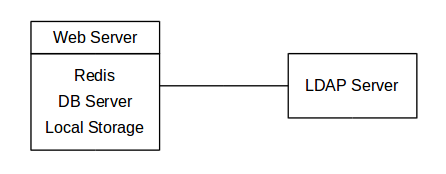
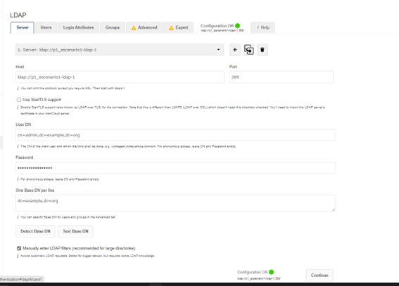
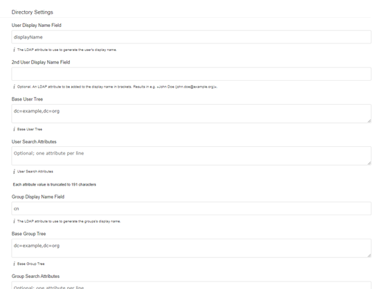
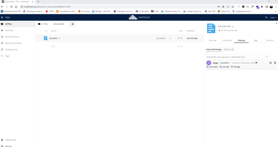

# Práctica 1: Despliegue de servicio ownCloud

## Contenidos

- [Entorno de desarrollo](#Entorno_de_desarrollo)
- [Descripción de la práctica](#Descripción_de_la_práctica)
- [Arquitectura cloud propuesta: Escenario 1](#Arquitectura_cloud_propuesta_Escenario_1)
    - [Arquitectura cloud implementada: Escenario 1](#Arquitectura_cloud_implementada_Escenario_1)
    - [Servicio web ownCloud](#Servicio_web_ownCloud)
    - [MariaDB](#MariaDB)
    - [Redis](#Redis)
    - [LDAP](#LDAP)
- [Arquitectura cloud propuesta: Escenario 2](#Arquitectura_cloud_propuesta_Escenario_2)
    - [Arquitectura cloud implementada: Escenario 2](#Arquitectura_cloud_implementada_Escenario_2)
    - [Redes](#Redes)
    - [Replicación de ownCloud](#Replicación_de_ownCloud)
    - [HAProxy](#HAProxy)
- [Pruebas realizadas](#Pruebas_realizadas)
- [Despliegue de la práctica](#despliegue)
- [Conclusiones](#conclusiones)
- [Referencias](#referencias)


<a name="Entorno_de_desarrollo"></a>
## Entorno de desarrollo

Se ha empleado Docker Desktop en Windows 11 22H2 con WSL2 con Ubuntu 22.04 LTS

<a name="Descripción_de_la_práctica"></a>
## Descripción de la práctica

<a name="Arquitectura_cloud_propuesta_Escenario_1"></a>
### Arquitectura cloud propuesta: Escenario 1

En un primer momento, se ha abordado el *escenario 1* propuesto en el guión de prácticas, el cual proponía el diseño y despliegue de un servicio Owncloud basado en contenedores según la arquitectura siguiente:



En este caso, se incluyen los siguientes 4 servicios:
- Servicio web owncloud
- MariaDB
- Redis
- LDAP

<a name="Arquitectura_cloud_implementada_Escenario_1"></a>
### Arquitectura cloud implementada: Escenario 1

A continuación, se procederá a explicar en detalle los servicios implementados así como los diferentes volúmenes creados para cada uno de los servicios necesarios. Se debe destacar que se ha hecho uso de Docker Compose para la puesta en marcha de esta arquitectura por su facilidad de integración y rapidez. El archivo docker-compose puede encontrarse [aquí](./docker-compose_escenario1.yml).

<a name="Servicio_web_ownCloud"></a>
#### Servicio web ownCloud

OwnCloud es una plataforma que permite almacenar y sincronizar archivos, compartir archivos con otros usuarios, colaborar en documentos, y también incluye otras características como el acceso remoto a archivos, la integración con aplicaciones de terceros y la encriptación de datos.

De esta manera, se tratarán diferentes aspectos para poder abordar con éxito dicha arquitectura.

- **Imagen Docker utilizada:**
    - owncloud/server:latest

- **Puertos de acceso:**
    Dado que en nuestro caso han surgido problemas con el certificado SSL cuando intentábamos acceder al market de ownCloud, se ha decidido exponer el puerto 8080 para permitir las conexiones HTTP.

- **Variables de entorno:**
    De la misma manera, para el correcto despliegue de ownCloud han sido necesarias las siguientes variables de entorno, las cuales se describen a continuación:

| Nombre variable      | Descripción                                                          | Valor       |
| --------------------| -------------------------------------------------------------------- | ------------|
| OWNCLOUD_DOMAIN      | Especifica el dominio y puerto en el que OwnCloud está alojado        | localhost:8080 |
| OWNCLOUD_TRUSTED_DOMAINS | Especifica los dominios que OwnCloud considera confiables          | localhost |
| OWNCLOUD_DB_TYPE     | Especifica el tipo de base de datos que se utiliza                    | mysql       |
| OWNCLOUD_DB_NAME     | Especifica el nombre de la base de datos que se utiliza para OwnCloud | owncloud    |
| OWNCLOUD_DB_USERNAME | Especifica el nombre de usuario que OwnCloud utiliza para conectarse a la base de datos | owncloud |
| OWNCLOUD_DB_PASSWORD | Especifica la contraseña que OwnCloud utiliza para conectarse a la base de datos | owncloud |
| OWNCLOUD_DB_HOST     | Especifica el nombre del host de la base de datos                      | mariadb     |
| OWNCLOUD_ADMIN_USERNAME | Especifica el nombre de usuario del administrador de OwnCloud        | admin       |
| OWNCLOUD_ADMIN_PASSWORD | Especifica la contraseña del administrador de OwnCloud                | admin       |
| OWNCLOUD_MYSQL_UTF8MB4 | Especifica la codificación de caracteres utilizada por la base de datos | true       |
| OWNCLOUD_REDIS_ENABLED | Especifica si OwnCloud está configurado para usar Redis como sistema de almacenamiento en caché | true |
| OWNCLOUD_REDIS_HOST | Especifica el nombre del host de Redis                                 | redis       |
| OWNCLOUD_LDAP_ENABLED | Especifica si OwnCloud está configurado para usar LDAP                | true        |


- **Configuración adicional:**
    - Se ha creado un volumen de tipo _named volume_ con el nombre _owncloud_ y que se monta en el directorio `/var/www/html` dentro del contenedor.

    - Integración con un servicio LDAP para la autenticación de usuarios. Para ello, se han seguido los siguientes pasos:

        1. Instalación del plugin "LDAP Integration".
        2. En el apartado _Server_ se debe configurar el ```Host```, ```Port```, ```User DN```, ```Password``` y ```One Base DN per file```, con el nombre del contenedor de LDAP, el puerto habilitado, el nombre distinguido (DN)...tal y como se puede observar en la siguiente imagen:
        
        2. En los apartados _Users_ y _Login Attributes_ se debe modificar el apartado ```LDAP Filter``` con los valores ```(objectclass=*)``` y ```(&(uid=%uid))```, respectivamente.
        3. En la pestaña _Advanced_ se deben modificar los campos _Base User Tree_ y _Base Group Tree_ por el valor ```dc=example,dc=org```:
        
        4. Adicionalmente, en la pestaña _Expert_, más concretamente en el campo ```Internal Username Attribute``` se debe indicar el valor ```uid``` para que de esta manera aparezca el valor uid que le asignemos a cada unos de los usuarios que añadamos con LDAP.

<a name="MariaDB"></a>
#### MariaDB

MariaDB es un sistema de gestión de bases de datos relacional (RDBMS) de código abierto que se basa en los mismos principios de diseño y los mismos objetivos que MySQL. MariaDB destaca por características de alta disponibilidad, escalabilidad y seguridad.

De esta manera, se tratarán diferentes aspectos para poder abordar con éxito dicha arquitectura.

- **Imagen Docker utilizada:**
    - mariadb:latest

- **Puertos de acceso:**
    En este caso no son necesarios.

- **Variables de entorno:**
    De la misma manera, para el correcto despliegue de MariaDB han sido necesarias las siguientes variables de entorno, las cuales se describen a continuación:

| Nombre variable      | Descripción                                                                      | Valor     |
|----------------------|----------------------------------------------------------------------------------|-----------|
| MYSQL_ROOT_PASSWORD  | especifica la contraseña de root para la base de datos MySQL                     | owncloud  |
| MYSQL_DATABASE       | especifica el nombre de la base de datos que se creará para OwnCloud en el servidor MySQL | owncloud  |
| MYSQL_USER           | especifica el nombre de usuario que se creará para OwnCloud en el servidor MySQL | owncloud  |
| MYSQL_PASSWORD       | especifica la contraseña que se utilizará para el usuario de OwnCloud en el servidor MySQL | owncloud  |


- **Configuración adicional:**
    - En este caso, se ha creado un volumen de tipo _bind mount_ en el directorio local `./MariaDB_data`, el cual se monta en el directorio `/var/lib/mysql` dentro del contenedor. Para ello, previamente se ha tenido que crear un directorio local para poder compratir dicho directorio con el contenedor de Docker en el que se despliega MariaDB:
    `mkdir ./MariaDB_data`.

<a name="Redis"></a>
#### Redis

Redis es un sistema de almacenamiento de datos en memoria de código abierto y de alta velocidad. Es utilizado para almacenar, gestionar y acceder a datos en tiempo real. Redis puede funcionar como una base de datos en memoria, una caché en memoria o un servidor de cola de mensajes, y admite diversas estructuras de datos, como cadenas, hashes, listas, conjuntos, conjuntos ordenados y mapas de bits.

De esta manera, se tratarán diferentes aspectos para poder abordar con éxito dicha arquitectura.

- **Imagen Docker utilizada:**
    - redis:latest

- **Puertos de acceso:**
    En este caso no son necesarios.

- **Variables de entorno:**
   No han sido necesarias variables de entornos para su correcta configuración.

- **Configuración adicional:**
    - Se ha creado un  _named volume_ con el nombre `redis`, el cual se monta en el directorio `/data` dentro del contenedor.

<a name="LDAP"></a>
#### LDAP

LDAP es un protocolo de red utilizado para acceder y gestionar información almacenada en un directorio de red. Un directorio de red es una base de datos jerárquica que se utiliza para almacenar información sobre usuarios, grupos, dispositivos y otros recursos de red. Se utiliza principalmente para autenticación y autorización en sistemas de red, y es especialmente útil en entornos empresariales y organizacionales. Al utilizar LDAP, los usuarios pueden acceder a diferentes recursos de red con una única credencial de inicio de sesión, y los administradores pueden gestionar y controlar el acceso a los recursos de red de manera centralizada.

De esta manera, se tratarán diferentes aspectos para poder abordar con éxito dicha arquitectura.

- **Imagen Docker utilizada:**
    - osixia/openldap:latest

- **Puertos de acceso:**
    En este caso son necesarios los puertos 389 y 636 para que LDAP escuche las peticiones.

- **Variables de entorno:**
    De la misma manera, para el correcto despliegue de LDAP han sido necesarias las siguientes variables de entorno, las cuales se describen a continuación:

| Nombre variable | Descripción | Valor |
| --- | --- | --- |
| LDAP_ORGANISATION | especifica el nombre de la organización para la cual se está configurando el servidor LDAP | example |
| LDAP_DOMAIN | especifica el dominio de la organización para la cual se está configurando el servidor LDAP | example.org |
| LDAP_ROOT | especifica el nodo raíz de la estructura de directorio LDAP | dc=example,dc=org |
| LDAP_ADMIN_USERNAME | especifica el nombre de usuario del administrador del servidor LDAP | admin |
| LDAP_ADMIN_PASSWORD | especifica la contraseña del administrador del servidor LDAP | admin |
| LDAP_CONFIG_ADMIN_ENABLED | especifica si se habilita el acceso a la configuración del servidor LDAP para el administrador | true |
| LDAP_CONFIG_ADMIN_USERNAME | especifica el nombre de usuario del administrador de configuración del servidor LDAP | admin |
| LDAP_CONFIG_ADMIN_PASSWORD | especifica la contraseña del administrador de configuración del servidor LDAP | admin |
| LDAP_ADDITIONAL_BOOTSTRAP_LDIF | especifica la ruta al archivo LDIF que se utiliza para importar datos adicionales al servidor LDAP durante la inicialización | /container/service/slapd/assets/test |


- **Configuración adicional:**
    - En este caso, se ha creado tres volúmenes de tipo _bind mount_ en las siguientes ubucaciones del directorio local:
        1. `./data/slapd/database:/var/lib/ldap`: Este volumen se utiliza para almacenar la base de datos LDAP en el host, lo que permite que los datos persistan incluso si el contenedor se detiene o se elimina. El directorio `/var/lib/ldap` en el contenedor se mapea al directorio `./data/slapd/database` en el host.
        2. `./data/slapd/config:/etc/ldap/slapd.d`: Este volumen se utiliza para almacenar la configuración del servidor LDAP en el host. El directorio `/etc/ldap/slapd.d` en el contenedor se mapea al directorio `./data/slapd/config` en el host.
        3. `./data/slapd/ldif:/container/service/slapd/assets/test`: Este volumen se utiliza para importar datos adicionales al servidor LDAP durante la inicialización, más específicamente usuarios y organizaciones.
    Se debe destacar que para la creación de estos volúmenes se han tenido que seguir los siguientes pasos:
    1. Creación de las carpetas para almacenar los datos de LDAP:

    ```
    sudo mkdir -p ./data/slapd/config
    sudo mkdir ./data/slapd/database
    sudo mkdir ./data/slapd/ldif
    ```
    2. Concedemos permisos a esas carpetas:
    ```
    sudo usermod -aG docker $USER
    newgrp docker
    sudo chmod 775 -R /path-que-quieras/data/slapd
    sudo chown -R $USER:docker /path-que-quieras/data/slapd
    ```

<a name="Arquitectura_cloud_propuesta_Escenario_2"></a>
### Arquitectura cloud propuesta: Escenario 2

Posteriormente, se ha abordado el *escenario 2* propuesto en el guión de prácticas, el cual proponía el diseño y despliegue de un servicio Owncloud basado en contenedores según la arquitectura siguiente:


En este caso, se incluyen los siguientes servicios:

- Balanceo de carga con HAProxy u otra herramienta
- Servicio web owncloud
- MariaDB
- Redis
- LDAP
- Replicación de servicio de, al menos, uno de los servicios anteriores.

<a name="Arquitectura_cloud_implementada_Escenario_2"></a>
### Arquitectura cloud implementada: Escenario 2

A continuación, se procederá a explicar en detalle los servicios implementados así como los diferentes volúmenes creados para cada uno de los servicios necesarios así como la red virtual interna creada. Se debe destacar que se ha hecho uso de Docker Compose para la puesta en marcha de esta arquitectura por su facilidad de integración y rapidez. El archivo docker-compose puede encontrarse [aquí](./docker-compose.yml).

<a name="Redes"></a>
#### Redes
Se ha configurado una red virtual interna para interconectar todos los servicios, con excepción del servicio HAProxy, el cual tendrá acceso externo. Con esta configuración, se fortalece la seguridad de la solución implementada.

<a name="Replicación_de_ownCloud"></a>
#### Replicación de ownCloud
En este caso, se ha decidido replicar el servicio de ownCloud ofreciendo el mismo servicio y, por tanto, la misma configuración.

<a name="HAProxy"></a>
#### HAProxy
HAProxy es un software libre y de código abierto que proporciona balanceo de carga y alta disponibilidad para aplicaciones web. Es utilizado para distribuir el tráfico de red a varios servidores de backend y garantizar que la carga se distribuya de manera equilibrada, lo que mejora la escalabilidad y la disponibilidad de la aplicación. Además, HAProxy puede realizar tareas como el control de acceso, la autenticación y la autorización en la capa de aplicación. Es ampliamente utilizado por grandes empresas y sitios web de alto tráfico para mejorar el rendimiento y la escalabilidad de sus aplicaciones web.

De esta manera, se tratarán diferentes aspectos para poder abordar con éxito dicha arquitectura.

- **Imagen Docker utilizada:**
    - haproxy:2.7

- **Puertos de acceso:**
    En este caso es necesario lo puerto 80.

- **Dirección de estadísticas:**
     Para poder observar las estadísticas dle balanceador de carga, se puede acceder a al dirección `IP:80/haproxy?stats`.
- **Variables de entorno:**
    De la misma manera, para el correcto despliegue de ownCloud han sido necesarias las siguientes variables de entorno, las cuales se describen a continuación:

| Nombre variable | Descripción | Valor |
| --- | --- | --- |
| BALANCE |  Esta variable indica que el balanceador de carga está configurado para distribuir el tráfico de manera equilibrada entre las dos instancias de OwnCloud en función de la dirección IP del cliente | source |
| OWNCLOUD_IP | Esta variable especifica la dirección IP de la primera instancia de OwnCloud que se utilizará para distribuir el tráfico. | 10.5.0.6 |
| OWNCLOUD2_IP | Esta variable especifica la dirección IP de la segunda instancia de OwnCloud que se utilizará para distribuir el tráfico. | 10.5.0.7 |
| OWNCLOUD_PORT | Esta variable especifica el puerto en el que el servicio de OwnCloud se ejecuta en ambas instancias. | 8080 |

- **Configuración adicional:**
    - En este caso, se ha creado dos volúmenes:
        1. `haproxy_conf:/usr/local/etc/haproxy`: Este volumen es utilizado para montar un volumen nombrado llamado "_haproxy_conf_" en el directorio `/usr/local/etc/haproxy` del contenedor de HAProxy. Este volumen nombrado puede ser utilizado para compartir el archivo de configuración de HAProxy entre múltiples contenedores.
        2. `./haproxy/haproxy.cfg:/usr/local/etc/haproxy/haproxy.cfg`: Este volumen está siendo utilizado para montar el archivo de configuración de HAProxy llamado [haproxy.cfg](./haproxy/haproxy.cfg) desde el host local en el directorio `/usr/local/etc/haproxy` del contenedor de HAProxy. Esto permite que el archivo de configuración se pueda modificar fácilmente en el host local y que los cambios sean reflejados automáticamente en el contenedor de HAProxy. Este archivo se utiliza para definir los servidores y los puertos que HAProxy debe escuchar, así como para definir las reglas de balanceo de carga.

<a name="Pruebas_realizadas"></a>
## Pruebas realizadas
Se ha probado el correcto funcionamiento de ambos escenarios compartiendo ficheros entre los distintos usuarios creados así como 'tirando' el servicio réplica y comprobando que la plataforma no dejaba de funcionar y proporcionar servicio:




<a name="despliegue"></a>
## Despliegue de la práctica
Se debe destacar que en el archivo `docker-compose_escenario1.yml` se encuentra lo correspondiente al escenario 1. Sin embargo, dado que el escenario 2 abarca ambos, se procederá a levantar dichos servicios. Para poder realizar las diferentes pruebas y con el objetivo de facilitar dicho despliegue, se ha creado un script llamado `build.sh` que permite echar abajo (`down`) los contenedores y volúmenes que existieran y levantarlos nuevamente. Además, se ha incluido una sentencia para poder ejecutar otro script que se encuentra en la carpeta `./data/slapd/ldif` y que se encarga de añadir algunos usuarios, categorías y modificar las contraseñas de dichos usuarios.
Por tanto, una vez que se dispone de todos los archivos de condifuración, basta con ejecutar el siguiente comando:

```
./build.sh
```
En caso de ser necesario, se puede acceder a las estadísticas de HAProxy para ver qué replicas están funcionando o cuál de ellas ha caído. Para ello, se debe acceder a la siguiente URL:

```
http://localhost/haproxy?stats
```

<a name="conclusiones"></a>
## Conclusiones
El desarrollo de la práctica me ha permitdo no solamente conocer y aprender términos y tecnologías nuevas sino también aprender a solucionar porblemas atípicos y que requieren de mucha dedicación y paciencia. Sin ir más lejos, durante el desarrollo de la práctica he tenido un problema principal y ha sido el certificado SSL de ownCloud, el cual indicaba que había expirado y sin el cual no podría hacer la integración con LDAP. Sin embargo, tras días de intentar todo lo posible sin éxito, decidí leer toda la documentación oficial de ownCloud y descubrí que el problema era la imagen utilizada (había quedado desfasada) y el puerto usado, ya que en las nuevas versiones era necesario utilizar el puerto 8080 para llevar a cabo conexiones HTTP.
Tras realizar los dos escenarios me he quedado con la "espina" de poder intentar, al menos, replicar el escenario 2 con Kubernetes, ya que es una herramienta que me llama mucho la atención y de la que me gustaría aprender. Sin embargo, debido al problema anteriormente mencionado, no me ha dado tiempo a más.

<a name="referencias"></a>
## Referencias
- [https://github.com/osixia/docker-openldap](https://github.com/osixia/docker-openldap)
- [https://www.openldap.org/doc/admin26/quickstart.html](https://www.openldap.org/doc/admin26/quickstart.html)
- [https://computingforgeeks.com/run-openldap-server-in-docker-containers/#google_vignette](https://computingforgeeks.com/run-openldap-server-in-docker-containers/#google_vignette)
- [http://docs.haproxy.org/2.6/intro.html](http://docs.haproxy.org/2.6/intro.html)
- [https://doc.owncloud.com/server/next/admin_manual/installation/docker/](https://doc.owncloud.com/server/next/admin_manual/installation/docker/)
